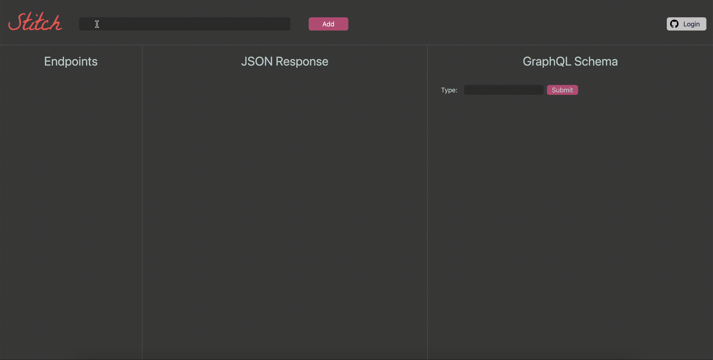

  

## What is Stitch?

Stitch is a lightweight GraphQL schema generation tool. You can use Stitch to load your RESTful HTTP endpoints and generate GraphQL schemas.

## How It Works

Stitch can be used directly from your browser!  Just navigate to http://stitch-ql.app and you’re off.  

**Adding Endpoints**
 
Copy & paste any endpoint that provides a JSON response into the input field and click Add. Your endpoint will populate in the Endpoints view, and the data associated with the endpoint will appear within the JSON Response view. You can add multiple endpoints to the application, and clicking on the endpoints in the Endpoints view will allow you to quickly navigate between the different JSON responses.  

**Adding Schema Fields**
 
Once you’ve added endpoints, you can click the ‘+’ button associated with each line of the JSON responses to add the desired fields to the GraphQL Schema view.  

**Configuring Your GraphQL Schema**
 
As you add types to your schema, those will appear immediately in the GraphQL Schema view. The data types are initially inferred, but can be edited through the drop down menu associated with each schema line item. You can also set types to be required, or delete types that you no longer want to include in your final schema.

The Type input field allows you to name your schema. Simply type what you wish to name the schema and hit ‘Submit’. You’ll see it reflected instantly in the schema view. 

**Exporting Your GraphQL Schema**
 
Once you have your schema built to your liking, you can click the copy button to copy to clipboard and paste it directly into your schema.js file in your app.  

**Authenticating Through GitHub**
 
You can connect your Github account to unlock saving and loading views.  
Once authenticated, you will see extra fields that allow you to save any created schemas, as well as load any previously created and saved schema views.

**Saving Views**
 
Add a name to your current view and click Save. Your saved view will appear in the drop down menu next to the ‘Save’ button.

**Loading Views**
 
To select a previously saved view, simply click on the drop down menu and select the desired schema view. 

#

## Contributing
 
Stitch is currently in beta release. We welcome all contributions and pull requests!

#

## Authors

- [Harrison Shih](https://www.linkedin.com/in/harrison-shih-8a021578/) - [@LatteBoy](https://github.com/LatteBoy)
- [Jenny Oh](https://www.linkedin.com/in/jennyjennyoh/)- [@jennyjennyoh](https://github.com/jennyjennyoh)
- [Keith Falcon](https://www.linkedin.com/in/keith-falcon-2750934a/) - [@falc0neye](https://github.com/falc0neye)
- [Nate Toll](https://www.linkedin.com/in/nate-toll-a761a611a/) - [@monster-truck](https://github.com/monster-truck)
- [Nicole Young](https://www.linkedin.com/in/nicoleyoung7501) - [@nyoung19](https://github.com/nyoung19)

#

## License

This project is licensed under the MIT License.
